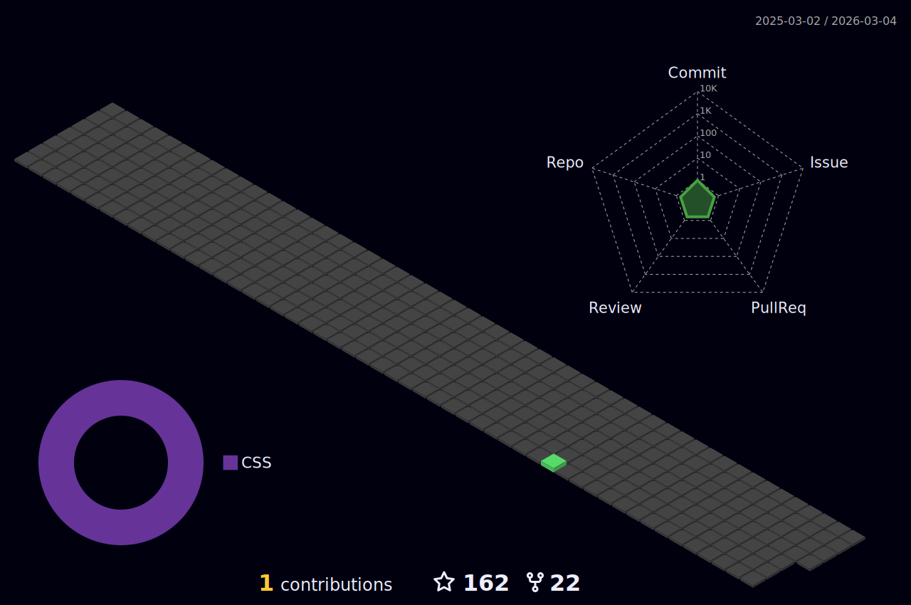

### Hey , I'm [Suraj Kumar!](https://suraj-996.github.io) 

###  🌱 I’m from Patna, Bihar, India .
###  🌱 I’m currently learning ...
- Java, Aspiring Java Developer

###  🌱 What do I do?
- ✔️ Though I have completed my 12th, I aspire to work as a programmer.

- ✔️ I'm a fast learner looking for interesting career opportunities as a Java developer. 
- 🔭 Checkout my portfolio: **[Portfolio](https://suraj-996.github.io)**
- 💼 See my resume: **[Resume](https://github.com/suraj-996/suraj-996/blob/main/Suraj_Kumar_Resume%20(2).pdf)**

### ⚡ One line that describes me best? 
A hard working boy who enjoys good humour & coding.😉😉

### 📫 How can you reach me?

### Familiar Tech Stack:

<!-- coding boy -->

<!-- language -->

 

### Used Tools:

 
 
 
 
  
<h2 align="center">📊 My Github Stats<h2>

 
   
  

   
  

  
  

  
 

  

hi
