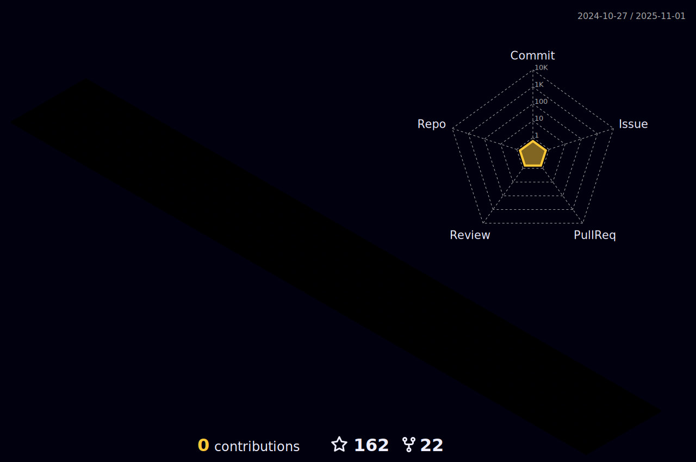

## Hey , I'm [Suraj!](https://suraj-996.github.io/links) 

### 🌱 I’m from Patna, India .
### 🌱 I’m currently learning ...
- Java, Aspiring Java Developer

### 🌱 What do I do?
- ✔️ Though I have completed my 12th, I aspire to work as a programmer.

- ✔️I'm a fast learner looking for interesting career opportunities as a Java developer. 

### ⚡ One line that describes me best? 
A hard working boy who enjoys good humour & coding.😉😉

### 📫 How can you reach me?

<!--   -->

<!--  -->

<!--   -->
<h2 align="center">Languages and Tools:</h2>
   
  

      
      
      
      
      
      

  
<h2 align="center">📊 My Github Stats<h2>

  
  

   
  

  
  

  
 

  

hello my name 
