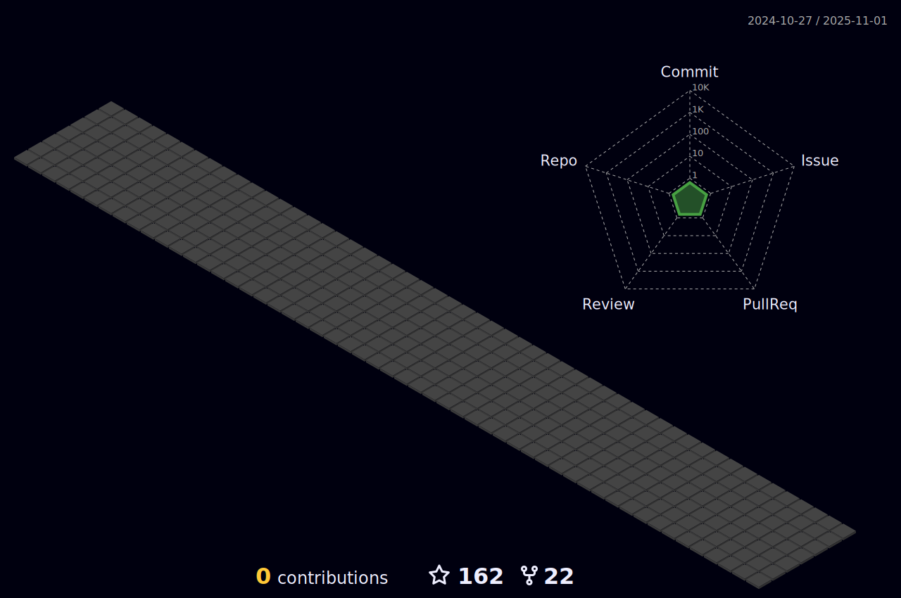

### Hey , I'm [Suraj Kumar!](https://suraj-996.github.io) 

###  🌱 I’m from Patna, Bihar, India .
###  🌱 I’m currently learning ...
- Java, Aspiring Java Developer

###  🌱 What do I do?
- ✔️ Though I have completed my 12th, I aspire to work as a programmer.

- ✔️ I'm a fast learner looking for interesting career opportunities as a Java developer. 
- 🔭 Checkout my portfolio: **[Portfolio](https://suraj-996.github.io)**
- 💼 See my resume: **[Resume](https://github.com/suraj-996/suraj-996/blob/main/Suraj_Kumar_Resume%20(2).pdf)**

### ⚡ One line that describes me best? 
A hard working boy who enjoys good humour & coding.😉😉

### 📫 How can you reach me?

### Familiar Tech Stack:

<!-- coding boy -->

<!-- language -->

 

### Used Tools:

 
 
 
 
  
<h2 align="center">📊 My Github Stats<h2>

 
   
  

   
  

  
  

  
 

  

 # 📃 Achievement List 📃
 

| Badge | Name | How to get | Needed amount | 
| :-: | :-: | :-: | :-: |
|  | Heart On Your Sleeve | (???) | <table>  <thead>  <tr>  <th>DEFAULT</th> <th>BRONZE</th>  <th>SILVER</th>  <th>GOLD</th>  </tr>  </thead>  <tbody>  <tr>  <td align="center"></td>   <td></td>  <td></td>  <td></td>  </tr>  <tr>  <td align="center">(?)</td>  <td align="center">(?)</td>  <td align="center">(?)</td>  <td align="center">(?)</td>  </tr>   </tbody>  </table> |
|  | Open Sourcerer | (???) | <table>  <thead>  <tr>  <th>DEFAULT</th> <th>BRONZE</th>  <th>SILVER</th>  <th>GOLD</th>  </tr>  </thead>  <tbody>  <tr>  <td align="center"></td>   <td></td>  <td></td>  <td></td>  </tr>  <tr>  <td align="center">(?)</td>  <td align="center">(?)</td>  <td align="center">(?)</td>  <td align="center">(?)</td>  </tr>   </tbody>  </table> |
|                  | Starstruck         | Created a repository that has many stars | <table>  <thead>  <tr>  <th>DEFAULT</th> <th>BRONZE</th>  <th>SILVER</th>  <th>GOLD</th>  </tr>  </thead>  <tbody>  <tr>  <td align="center"></td>   <td></td>  <td></td>  <td></td>  </tr>  <tr>  <td align="center">16</td>  <td align="center">128</td>  <td align="center">512</td>  <td align="center">4096</td>  </tr>   </tbody>  </table>      |
|                  | Quickdraw        | Gitty up! (closed an issue / pull request within 5 minutes of opening) | <table>  <thead>  <tr>  <th>DEFAULT</th>  </tr>  </thead>  <tbody>  <tr>  <td></td> </tr>  <tr>  <td align="center">1</td> </tr>   </tbody>  </table> |
|      | Pair Extraordinaire  | Coauthored commits on merged pull request | <table>  <thead>  <tr>  <th>DEFAULT</th> <th>BRONZE</th>  <th>SILVER</th>  <th>GOLD</th>  </tr>  </thead>  <tbody>  <tr>  <td align="center"></td>   <td></td>  <td></td>  <td></td>  </tr>  <tr>  <td align="center">1</td>  <td align="center">10</td>  <td align="center">24</td>  <td align="center">48</td>  </tr>   </tbody>  </table>      |
|      | Pull Shark  | Opened a pull request that has been merged | <table>  <thead>  <tr>  <th>DEFAULT</th> <th>BRONZE</th>  <th>SILVER</th>  <th>GOLD</th>  </tr>  </thead>  <tbody>  <tr>  <td align="center"></td>   <td></td>  <td></td>  <td></td>  </tr>  <tr>  <td align="center">2</td>  <td align="center">16</td>  <td align="center">128</td>  <td align="center">1024</td>  </tr>   </tbody>  </table>      |
|  | Galaxy Brain | Answered a discussion (got an accepted answer) | <table>  <thead>  <tr>  <th>DEFAULT</th> <th>BRONZE</th>  <th>SILVER</th>  <th>GOLD</th>  </tr>  </thead>  <tbody>  <tr>  <td></td>  <td></td>  <td></td>  <td></td>  </tr>  <tr>  <td align="center">2</td> <td align="center">8</td>  <td align="center">16</td>  <td align="center">32</td>  </tr>   </tbody>  </table>
|                  | YOLO        | Merged a pull request without a review | <table>  <thead>  <tr>  <th>DEFAULT</th>  </tr>  </thead>  <tbody>  <tr>  <td></td> </tr>  <tr>  <td align="center">1</td> </tr>   </tbody>  </table> |
|                  | Public Sponsor        | Sponsored an open source contributor through [GitHub Sponsors](https://github.com/sponsors) | <table>  <thead>  <tr>  <th>DEFAULT</th>  </tr>  </thead>  <tbody>  <tr>  <td></td> </tr>  <tr>  <td align="center">1</td> </tr>   </tbody>  </table> |

